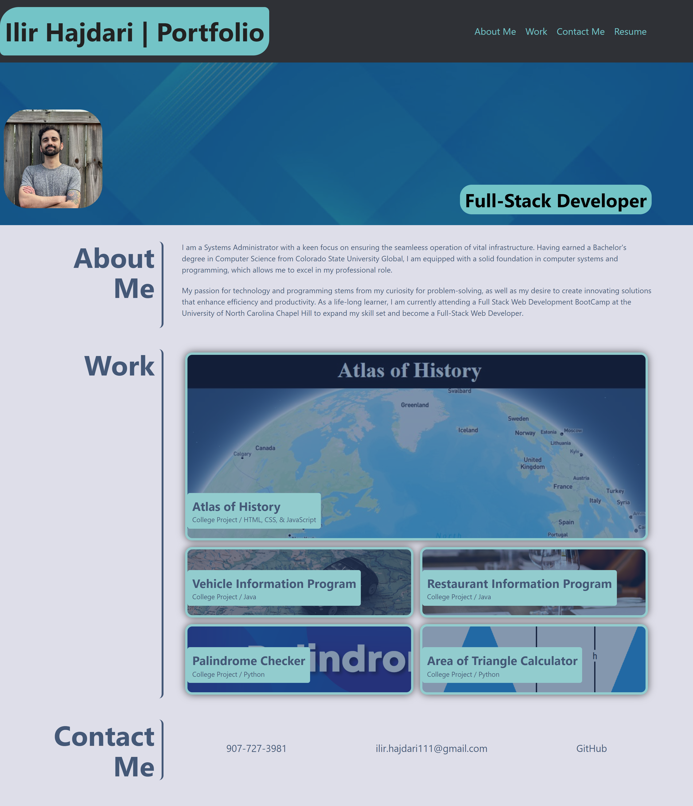

## Portfolio Website Readme

Welcome to my portfolio website! This website is designed to showcase my work samples to potential employers. The website is built to be user-friendly and provide easy access to relevant information.

# Getting Started

To get started, load the website on your preferred browers. You will be presented with my name, a recent photo, and links to sections about me, my work, my resume, and how to contact me. Click on any of the following links to navigate to the corresponding sections.

# Navigation

The navigation links on the website are designed to help you easily find the information you are looking for. Clicking on any of the links will automatically scroll the UI to the corresponding section.

# Work Samples

To view my work samples, click on the link to the section about my work. You will be preesented with titled images of my applications.

# Responsive Design

The website is built with a responsive layou that adapts to your viewpoint. This means that the website will adjust its design based on the size of your screen or device. So, wethere you are viewing the site on a desktop computer, tablet, or smartphone, you will have a seamless experience.

#Contact

If you have questions or would like to dicuss a potential job opportunity, please visit the contact section of the website. You can find my email address and other contact information there.

Thank you for considering me as a potential candidate for your open position. I hope you find my portfolio website helpful and informative.

# Image of Website

